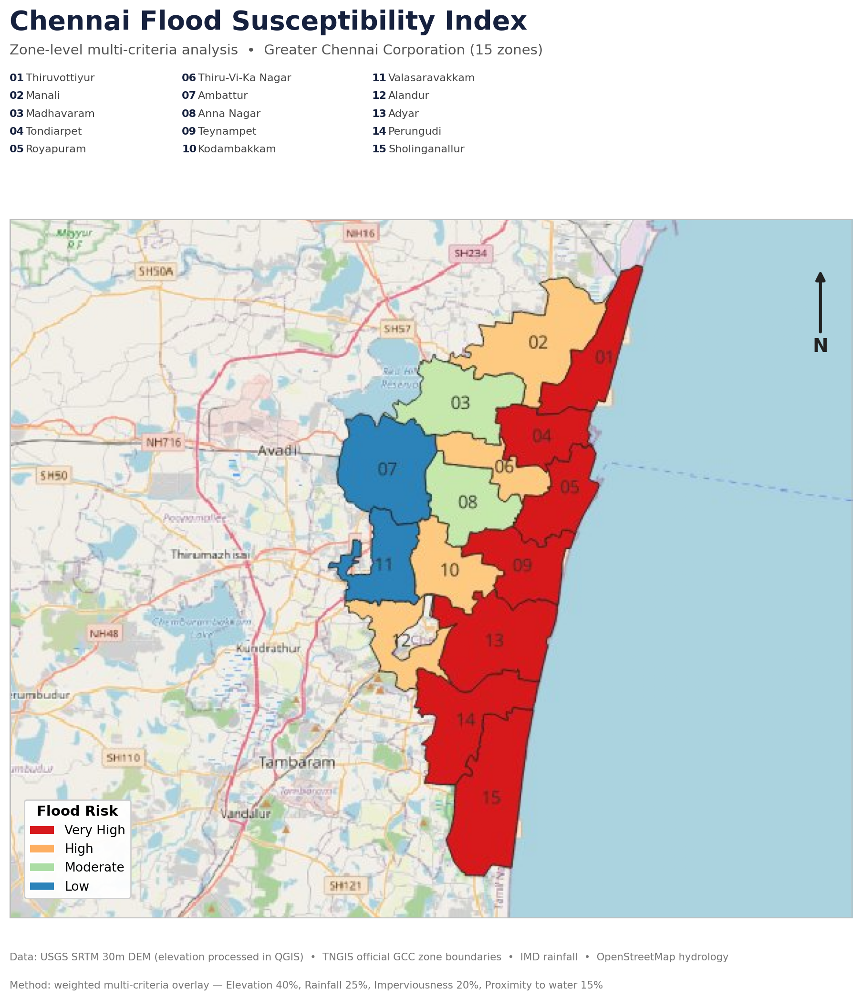

# Chennai Flood Susceptibility Index

**A zone-level flood risk assessment for Greater Chennai Corporation, built from official open geospatial data using a transparent multi-criteria methodology.**



\---

## The Problem

Chennai has flooded severely in 2015, 2021, and 2023. The same zones go underwater each time — not by chance, but because of low-lying terrain, lost wetlands, and concretised drainage corridors. Yet flood-risk information is often locked inside GIS software that the planners, councillors, and investors making decisions can't easily access.

This project produces a clear, ranked, zone-level flood susceptibility assessment for all 15 Greater Chennai Corporation (GCC) zones — built entirely from official, publicly available data.

\---

## The Approach

Rather than a black-box prediction, this uses a **weighted multi-criteria overlay** — a standard, transparent GIS methodology used in published flood-risk studies. Each zone is scored on four factors known to drive urban flooding:

|Factor|Weight|Why it matters|Data status|
|-|-:|-|-|
|Ground elevation|40%|Low-lying land pools water|**Real** — USGS SRTM 30m, processed in QGIS|
|Monsoon rainfall|25%|Higher rainfall load|Estimated — IMD reports|
|Imperviousness|20%|Concrete prevents absorption|Estimated|
|Proximity to water|15%|Near rivers/marsh floods first|Estimated|

Each factor is normalised to a 0–1 scale, weighted, and combined into a single susceptibility score (0–100). Zones are then classified into four risk bands by natural breaks.

> \*\*Honest note on data:\*\* Elevation — the single most important factor — uses real SRTM data extracted via zonal statistics in QGIS against official TNGIS zone boundaries. The remaining three factors are currently informed estimates. See \*Roadmap\* for how these become fully real.

\---

## Key Findings

!\[Zone Ranking](assets/chennai\_susceptibility\_ranking.png)

The five highest-susceptibility zones are **Sholinganallur, Perungudi, Thiruvottiyur, Adyar, and Tondiarpet** — and the analysis explains *why*:

* **Sholinganallur \& Perungudi** sit on the Pallikaranai marsh and OMR wetland corridor, at just 3–4m elevation
* **Thiruvottiyur \& Tondiarpet** are low northern coastal zones near the Buckingham Canal
* **Ambattur**, the inland western zone at 16m, ranks lowest in risk — consistent with its flood record

This matches the lived reality of where Chennai actually floods, which validates the methodology.

\---

## Who This Is For

|Organisation|Use case|
|-|-|
|Greater Chennai Corporation|Prioritise stormwater drainage investment by zone|
|Chennai Metropolitan Development Authority|Flag high-risk zones in development approvals|
|Tamil Nadu State Disaster Management Authority|Pre-position monsoon response resources|
|Insurance providers|Zone-level flood risk for property underwriting|
|Real estate / infrastructure developers|Site due diligence|

\---

## Tech Stack

* **QGIS** — DEM merging, clipping, validation, zonal statistics
* **Python** — NumPy (multi-criteria scoring), Matplotlib (cartography)
* **Data** — USGS SRTM • TNGIS (official GCC zones) • IMD • OpenStreetMap

\---

## Data Pipeline

```
1. Boundary    ->  Official GCC 15-zone layer (TNGIS)
2. Elevation   ->  SRTM 30m tiles -> merge -> clip to boundary -> zonal stats (QGIS)
3. Scoring     ->  Normalise factors -> weighted overlay -> susceptibility score
4. Classify    ->  Natural-break bands -> Very High / High / Moderate / Low
5. Visualise   ->  Static map + ranked chart + per-zone scores
```

\---

## Roadmap (v2)

This is v1, built on a sound, honest methodology. Planned upgrades:

* **Real flood validation** — extract the actual December 2015 flood extent from Sentinel-1 radar imagery (Google Earth Engine) and validate scores against observed inundation
* **Real imperviousness** — derive from Sentinel-2 land-cover classification rather than estimates
* **Real rainfall surfaces** — interpolate IMD station data into a continuous rainfall raster
* **Ward-level granularity** — drill from 15 zones to 200+ wards once boundary data allows

\---

## Repository Structure

```
chennai-flood-risk/
├── data/
│   ├── raw/            # Source boundaries, DEM
│   └── processed/      # susceptibility\_index.json, elevation per zone
├── notebooks/
│   ├── 01\_data\_prep.ipynb
│   ├── 02\_susceptibility\_scoring.ipynb
│   └── 03\_visualization.ipynb
├── assets/             # Maps and charts
└── README.md
```

\---

## Methodology Note

Weighted multi-criteria overlay (also called weighted linear combination / AHP-style scoring) is an established flood-susceptibility technique in the GIS literature. It is transparent and auditable — every zone's score can be traced back to its input factors — which is preferable to an opaque model when ground-truth flood labels are not yet available. The roadmap addresses moving from this index toward a validated predictive model.

\---

*Built with open data and reproducible methods. Author: \[Samuel Jebakumar] | \[https://www.linkedin.com/in/samueljebakumar/] |* 

